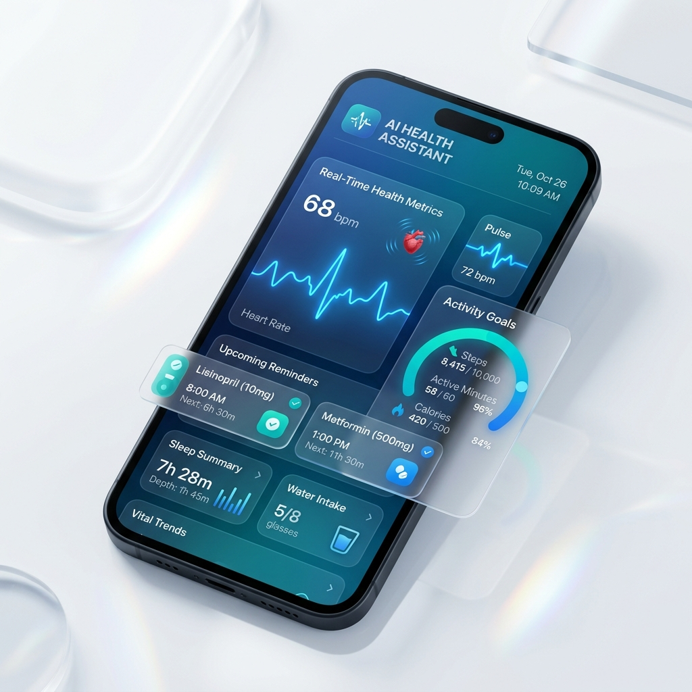

<p align="center">
  
</p>

<h1 align="center">MediMind AI</h1>

<p align="center">
  <strong>Your Intelligent Health Companion — Powered by AI</strong>
</p>

<p align="center">
  <a href="https://adi140108.github.io/MediMind-Ai/">🌐 Live Demo</a> &nbsp;·&nbsp;
  <a href="#features">✨ Features</a> &nbsp;·&nbsp;
  <a href="#tech-stack">🛠️ Tech Stack</a> &nbsp;·&nbsp;
  <a href="#getting-started">🚀 Getting Started</a>
</p>

<p align="center">
  
  
  
  
</p>

---

## 🖼️ Preview

<p align="center">
  
</p>

---

## ✨ Features

### 🔍 AI Symptom Checker
- Search symptoms (headache, fever, cough) for instant AI clinical assessment
- Displays severity indicators, recommendations, and OTC medication guidance
- Responsive advice panels that only render after search

### 📊 Vitals Dashboard
- Track **Heart Rate**, **Blood Pressure**, **Blood Sugar**, and **SpO₂** with visual indicators
- **Manual Logging** — enter readings to update indicators, recalculate ranges, and log history
- All vitals reflect exact patient inputs — no artificial drift

### 📅 Specialist Booking
- Interactive physician profiles with experience, ratings, and schedules
- Category filters: Pulmonology, Cardiology, Neurology, Endocrinology
- End-to-end ticket generation with reference codes (e.g. `Ref: MM-TX-10934`)

### 🔒 Secure Medical Records
- **Drag & Drop** lab reports (PDF, JPG, PNG) into a simulated OCR extraction sandbox
- Clickable reports dynamically update the biometrics table (Hemoglobin, WBC, TSH, Cholesterol)
- AI Health Synthesis — generates comprehensive summaries with progress scores and action items

---

## 🛠️ Tech Stack

| Layer | Technology |
|-------|-----------|
| **Framework** | [Astro](https://astro.build/) — Static site generation with component islands |
| **Styling** | Vanilla CSS with custom design tokens, glassmorphism, HSL variables |
| **Typography** | [Inter](https://fonts.google.com/specimen/Inter) + [JetBrains Mono](https://fonts.google.com/specimen/JetBrains+Mono) |
| **State** | Browser `sessionStorage` — zero database overhead |
| **Deploy** | GitHub Actions → GitHub Pages |

---

## 🚀 Getting Started

### Prerequisites

- [Node.js](https://nodejs.org/) 18+ and npm

### Install & Run

```bash
# Clone the repository
git clone https://github.com/Adi140108/MediMind-Ai.git
cd MediMind-Ai

# Install dependencies
npm install

# Start the dev server
npm run dev
```

Open [http://localhost:4321](http://localhost:4321) in your browser.

### Build for Production

```bash
npm run build
```

Output is generated in the `dist/` directory.

---

## 📁 Project Structure

```
MediMind-Ai/
├── .github/workflows/    # GitHub Actions CI/CD
├── public/               # Static assets (logo, favicon, images)
├── src/
│   ├── components/       # Reusable Astro components
│   │   ├── Header.astro
│   │   ├── Hero.astro
│   │   ├── Features.astro
│   │   ├── LiveChecker.astro
│   │   ├── Footer.astro
│   │   └── ...
│   ├── layouts/          # Page layout wrapper
│   ├── pages/            # Route pages
│   │   ├── index.astro       # Home — Symptom Checker
│   │   ├── dashboard.astro   # Vitals Dashboard
│   │   ├── doctors.astro     # Specialist Booking
│   │   └── records.astro     # Medical Records Vault
│   └── styles/
│       └── global.css    # Design system & tokens
├── astro.config.mjs      # Astro configuration
├── package.json
└── tsconfig.json
```

---

## 📄 License

This project is licensed under the [MIT License](LICENSE).

---

<p align="center">
  Built with ❤️ by <a href="https://github.com/Adi140108">Adithya</a>
</p>
